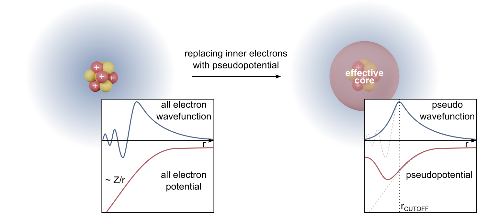

# 密度汎関数理論と固有値問題の基礎
密度汎関数理論（DFT）は、多電子系の基底状態を電子密度で扱うための理論である。計算としてのDFTは、Kohn–Sham方程式という固有値問題を自己無撞着に解く手続きとして実装されている。

## 目次
- 固有値問題
- 量子力学と固有値問題
- 多電子問題が難しい理由
- DFTの基本定理
- Kohn–Sham方程式
- 自己無撞着性と非線形固有値問題
- 離散化と基底展開
- 周期系とk点
- 擬ポテンシャルとPAW
- 交換相関汎関数
- 全エネルギーと二重数え上げ
- 力と応力
- 固有値の読み方
- 収束と数値安定性
- よく起きる問題の整理
- まとめと展望
- 参考文献

### 参考ドキュメント
1. 小崎健一郎, 第一原理電子状態計算の基礎と応用（講義資料PDF）  
   https://t-ozaki.issp.u-tokyo.ac.jp/mpcoms2021_lectures/Ozaki-Lec1.pdf
2. 常田貴夫, 密度汎関数法の基礎（講義資料PDF）  
   https://www2.riken.jp/qcl/members/tsuneda/web/dft05-sec1.pdf
3. Quantum ESPRESSO, PWscf User's Guide (v.7.5)（PDF）  
   https://www.quantum-espresso.org/Doc/user_guide_PDF/pw_user_guide.pdf

## 固有値問題
固有値問題とは、ある線形作用（行列または線形演算子）$A$に対して、$A\mathbf{x}=\lambda\mathbf{x}$を満たすスカラー$\lambda$と非零ベクトル$\mathbf{x}$を求める問題である。$\lambda$が固有値、$\mathbf{x}$が固有ベクトルであり、$A$がその方向に対して伸縮（符号を含む倍率）だけを与えることを意味する。

物理では、$A$がエネルギー演算子（ハミルトニアン）や応答関数の線形化などとして現れ、固有値が観測量（エネルギー準位など）に対応する。数値計算では、$A$が巨大で疎であることが多く、全固有値を求めるのではなく、低い方から数本だけを反復法で求める設計が重要になる。

### エルミート性と実固有値
$A$がエルミート（行列なら$A=A^\dagger$）であれば、固有値は実数であり、異なる固有値に属する固有ベクトルは直交化できる。量子力学の観測量はエルミート演算子で表されるため、固有値が実数であることは観測可能性と整合する。

数値的には、エルミート性は反復固有値解法の設計を簡単にし、安定性も高める。DFTのKohn–Shamハミルトニアンは（通常の条件下で）エルミートであるため、固有値問題として扱いやすい構造をもつ。

### レイリー商と変分的性質
エルミート行列$A$に対し、任意の非零ベクトル$\mathbf{x}$についてレイリー商
$$
\rho_A(\mathbf{x})=\frac{\mathbf{x}^\dagger A\mathbf{x}}{\mathbf{x}^\dagger \mathbf{x}}
$$
を定義できる。$\rho_A(\mathbf{x})$は、$\mathbf{x}$を規格化したときの期待値に相当し、最小固有値は$\rho_A(\mathbf{x})$の最小値として特徴づけられる。

より一般に、$k$番目の固有値は部分空間上の最小化・最大化で表される（Courant–Fischerの原理）。この変分的性質は、基底状態や低励起の固有状態を狙って求める反復法（Lanczos、Davidson、LOBPCGなど）が機能する理論的根拠の一つである。

### 一般化固有値問題
基底が直交していない場合、固有値問題は
$$
H\mathbf{c}=\varepsilon S\mathbf{c}
$$
という一般化固有値問題として現れる。$S$は重なり行列であり、$S$が正定値であれば$S^{1/2}$による変換で標準形に戻すこともできるが、巨大系では直接変換が重いことがある。

局在基底（原子軌道、ガウス基底、数値原子軌道など）では一般化固有値問題が自然に出現する。一方、平面波基底では基底が直交するため、しばしば$S=I$となり標準固有値問題に近い形になる。

### 非線形固有値問題
$A$自体が未知量に依存する場合、例えば$A=A(\mathbf{x})$や$A=A(\rho)$のような形では、固有値問題は非線形になる。DFTのKohn–Sham方程式は、ハミルトニアンが電子密度$\rho$に依存するため、非線形固有値問題の代表例である。

非線形性があると、固有値ソルバだけでは閉じず、密度更新と混合を含む反復（自己無撞着計算）が必要になる。したがってDFTを理解するには、固有値問題と自己無撞着反復の両方を同時に見通す必要がある。

## 量子力学と固有値問題
一電子の量子力学では、シュレディンガー方程式は固有値方程式として書ける。
$$
\hat{H}\psi_n(\mathbf{r})=E_n\psi_n(\mathbf{r})
$$
ここで$\hat{H}$はハミルトニアン、$\psi_n$は固有関数、$E_n$は固有値（エネルギー）である。境界条件（無限遠での減衰、周期境界など）と正規化条件が加わることで、離散準位やバンドが定まる。

固有関数は波動関数の空間分布を与え、固有値はその状態のエネルギーを与える。固有値問題としての見方は、量子状態を線形代数の言葉で扱う道具立てを提供し、DFTにおけるKohn–Sham軌道の位置づけを理解する助けになる。

### 期待値と最小化
規格化された波動関数$\psi$に対し、エネルギー期待値は
$$
\langle \hat{H}\rangle_\psi=\int \psi^*(\mathbf{r})\hat{H}\psi(\mathbf{r})\,d\mathbf{r}
$$
で与えられる。基底状態はこの期待値を最小にする状態であり、これが変分原理である。

固有値問題は、変分原理に基づく最小化としても理解できる。DFTはまさに、基底状態エネルギーをある汎関数の最小化として捉え直すことで、多電子問題を扱いやすい形に再構成する理論である。

## 多電子問題が難しい理由
$N$電子系の非相対論的ハミルトニアンは、原子単位系で
$$
\hat{H}
=
\sum_{i=1}^N\left(-\frac{1}{2}\nabla_i^2+v_{\mathrm{ext}}(\mathbf{r}_i)\right)
+\sum_{i<j}\frac{1}{|\mathbf{r}_i-\mathbf{r}_j|}
$$
で与えられる。波動関数$\Psi(\mathbf{r}_1,\dots,\mathbf{r}_N)$は$3N$次元空間上の関数であり、反対称性（フェルミ統計）も満たす必要がある。

この高次元性により、波動関数を直接表現して最小化することは急速に困難になる。Hartree–Fockや多体摂動、配置間相互作用などは波動関数の近似に立脚するが、DFTは変数を電子密度$\rho(\mathbf{r})$へ落とすことで次元を劇的に下げる立場を取る。

### 電子密度
電子密度は
$$
\rho(\mathbf{r})
=
N\int |\Psi(\mathbf{r},\mathbf{r}_2,\dots,\mathbf{r}_N)|^2\,d\mathbf{r}_2\dots d\mathbf{r}_N
$$
で定義される。$\rho(\mathbf{r})$は3次元関数であり、波動関数の情報の一部だけを保持するが、基底状態については十分であるという主張がDFTの出発点になる。

密度に基づく記述は、固体や表面、欠陥のように自由度が大きい系で特に威力を発揮する。一方で、励起状態や強相関、分散力などは近似の影響を強く受けるため、密度だけで何でも自動的に決まると考えるのは危険である。

## DFTの基本定理
DFTの中心は、基底状態におけるエネルギーを電子密度の汎関数として表し、その最小化で基底状態密度とエネルギーを得るという構造である。ここで汎関数とは、関数$\rho(\mathbf{r})$を入力としてスカラー$E$を返す写像である。

### Hohenberg–Kohnの主張
Hohenberg–Kohnの定理は、基底状態密度$\rho_0(\mathbf{r})$が外部ポテンシャル$v_{\mathrm{ext}}(\mathbf{r})$（定数の不定性を除く）を一意に定めることを示す。これにより、ハミルトニアンが決まり、基底状態のあらゆる観測量は$\rho_0$の汎関数として書けるという見通しが得られる。

ただし、どの密度が物理的に許されるか（$v$表現可能性、$N$表現可能性）という数学的な条件は繊細である。実装上は、許される密度の集合の中でエネルギー汎関数を最小化するという形に落とし込むことで、理論と計算を接続する。

### エネルギー汎関数の形
外部ポテンシャルが与えられたとき、基底状態エネルギーは
$$
E[\rho]=F[\rho]+\int v_{\mathrm{ext}}(\mathbf{r})\rho(\mathbf{r})\,d\mathbf{r}
$$
と書ける。$F[\rho]$は普遍汎関数であり、運動エネルギーと電子間相互作用を含むが、$v_{\mathrm{ext}}$には依存しないとされる。

この式の意義は、物質ごとの差異が$v_{\mathrm{ext}}$の項に現れ、電子間相互作用の扱いが$F[\rho]$に集約される点にある。計算で難しいのは$F[\rho]$の具体形であり、Kohn–Sham構成はその難しさを一粒子方程式へ写像する。

### Levyの制限付き探索
Levyの制限付き探索は、$F[\rho]$を
$$
F[\rho]=\min_{\Psi\to\rho}\langle \Psi|\hat{T}+\hat{V}_{ee}|\Psi\rangle
$$
として定義し、許される波動関数の集合上の最小化として与える。これにより、$v$表現可能性の議論を避けつつ、$N$表現可能な密度の範囲で厳密な定式化が可能になる。

この見方は、DFTが単なる近似ではなく、原理的には厳密な最小化問題であることを明確にする。実際の計算は、交換相関汎関数の近似によって閉じるが、最小化の骨格はこの定式化に基づいている。

## Kohn–Sham方程式
Kohn–Sham（KS）法は、相互作用する電子系の基底状態密度を、ある非相互作用（ただし有効ポテンシャルは密度依存）系の密度として再現する構成である。これにより、多体の難しさを、見かけ上一電子の固有値問題の集合へ移し替える。

### KS方程式の形
原子単位系で、KS方程式は
$$
\left[
-\frac{1}{2}\nabla^2
+v_{\mathrm{ext}}(\mathbf{r})
+v_H[\rho](\mathbf{r})
+v_{\mathrm{xc}}[\rho](\mathbf{r})
\right]\phi_i(\mathbf{r})
=
\varepsilon_i \phi_i(\mathbf{r})
$$
である。$v_H$はHartreeポテンシャルで
$$
v_H(\mathbf{r})=\int \frac{\rho(\mathbf{r}')}{|\mathbf{r}-\mathbf{r}'|}\,d\mathbf{r}'
$$
と定義され、$v_{\mathrm{xc}}$は交換相関ポテンシャルで
$$
v_{\mathrm{xc}}(\mathbf{r})=\frac{\delta E_{\mathrm{xc}}[\rho]}{\delta \rho(\mathbf{r})}
$$
で定義される。

ここで$\phi_i$はKS軌道、$\varepsilon_i$はKS固有値である。KS方程式は見かけ上一電子の固有値問題であるが、ポテンシャルが$\rho$に依存するため、方程式全体としては非線形である。

### 密度の構成
電子密度はKS軌道から
$$
\rho(\mathbf{r})=\sum_i f_i |\phi_i(\mathbf{r})|^2
$$
で構成される。$f_i$は占有数であり、金属や有限温度ではスメアリングにより$0<f_i<1$となることがある。

この式は、密度が軌道の二乗和で与えられることを意味し、密度更新が固有ベクトルの更新と直結している点が重要である。したがってKS計算は、固有値問題と密度更新が絡み合う反復として動作する。

### スピンを含む場合
スピン分極を許す場合、密度は$\rho_\uparrow,\rho_\downarrow$に分かれ、交換相関汎関数は$E_{\mathrm{xc}}[\rho_\uparrow,\rho_\downarrow]$となる。方程式はスピンごとに書け、$v_{\mathrm{xc}}$もスピン依存になる。

非共線磁性やスピン軌道相互作用を含む場合、軌道は2成分スピノルとなり、ハミルトニアンは行列演算子になる。形式は固有値問題のままであるが、未知量の自由度が増えるため収束や計算量の感覚は変わる。

## 自己無撞着性と非線形固有値問題
KSハミルトニアンを$\hat{H}_{\mathrm{KS}}[\rho]$と書くと、KS方程式は
$$
\hat{H}_{\mathrm{KS}}[\rho]\phi_i=\varepsilon_i\phi_i,\quad
\rho=\sum_i f_i|\phi_i|^2
$$
という自己参照構造をもつ。$\rho$が決まらないと$\hat{H}_{\mathrm{KS}}$が決まらず、$\hat{H}_{\mathrm{KS}}$が決まらないと$\rho$が決まらないという循環がある。

この循環を解くために、初期密度$\rho^{(0)}$から出発し、固有値問題を解いて新しい密度$\rho_{\mathrm{out}}^{(n)}$を得て、それを混合して$\rho^{(n+1)}$を作る反復を行う。混合（線形混合、Pulay混合など）は単なる数値技巧ではなく、非線形固定点反復の収束性を左右する中核である。

### 反復固有値解法との関係
DFTの固有値問題は巨大であり、行列を明示的に作って完全対角化することは多くの場合不可能である。そのため、$H\mathbf{v}$の作用（行列ベクトル積、またはハミルトニアン適用）だけを使う反復法が使われる。

代表的にはLanczos法、Davidson法、LOBPCG法などがあり、いずれも低エネルギー側の少数固有対を効率よく求める設計である。KS計算では、固有値解法の内側反復と自己無撞着の外側反復が入れ子になり、どちらの収束も計算の成否を決める。

### 反復法が機能する理由
基底状態近傍の固有状態は、レイリー商の最小化として特徴づけられるため、勾配情報や部分空間拡張に基づく反復法が収束しやすい。特にエルミート性と変分原理の組み合わせは、低固有値探索に強い構造を与える。

一方、金属のようにフェルミ準位付近の状態が密に並ぶ場合、固有値の分離が弱くなり、反復法も自己無撞着反復も難しくなりやすい。その場合はスメアリング、より強い混合抑制、より良い前処理などが必要になる。

## 離散化と基底展開
連続空間の偏微分方程式であるKS方程式は、数値計算では有限次元の線形代数問題へ落とす必要がある。これが離散化であり、基底展開や実空間格子などの表現方法が選択される。

### 平面波基底
周期系では平面波基底が広く使われる。軌道を
$$
\phi_{n\mathbf{k}}(\mathbf{r})=\sum_{\mathbf{G}} c_{n\mathbf{k}}(\mathbf{G})\,e^{i(\mathbf{k}+\mathbf{G})\cdot \mathbf{r}}
$$
と展開し、運動エネルギーは$|\mathbf{k}+\mathbf{G}|^2/2$で対角化される。カットオフ$E_{\mathrm{cut}}$により$|\mathbf{k}+\mathbf{G}|^2/2\le E_{\mathrm{cut}}$を満たす成分だけを残し、有限次元の固有値問題にする。

平面波は直交基底であり、基底依存の偏りが少なく、収束性を$E_{\mathrm{cut}}$で系統的に制御できる。一方で、原子核近傍の急峻な振る舞いを表すには多数の平面波が必要であり、擬ポテンシャルやPAWと組み合わせて実用化される。

### 局在基底
原子軌道やガウス基底、数値原子軌道などの局在基底では、必要な自由度を少なくできることがある。特に分子系や局在電子が支配的な系で効率が良いことがある。

局在基底は一般に直交しないため、$H\mathbf{c}=\varepsilon S\mathbf{c}$の一般化固有値問題となる。基底不完全性や基底重ね合わせ誤差の議論が重要になり、$E_{\mathrm{cut}}$のような単純な一つの収束パラメータだけでは語れない場合がある。

### 実空間格子
実空間格子法は、$\phi(\mathbf{r})$を格子点上の値として表し、微分を差分や有限要素で近似する。ポテンシャルの局所性を活かしやすく、境界条件や不均一格子を扱いやすい利点がある。

一方で、周期系ではフーリエ空間（平面波）の高速性が強力であり、実装の成熟度もコードにより差がある。どの離散化でも、最終的には巨大な固有値問題を反復で解くという点は共通である。

### 表現方法の比較
| 表現 | 主変数 | 代表的な数値問題 | 収束の制御 | 代表的な注意点 |
|---|---|---|---|---|
| 平面波 | $c_{n\mathbf{k}}(\mathbf{G})$ | 標準固有値問題 | $E_{\mathrm{cut}}$とk点 | 擬ポテンシャル/PAWの選択が支配的になりやすい |
| 局在基底 | 係数$\mathbf{c}$ | 一般化固有値問題 | 基底の拡張 | 基底依存の偏りと重なり行列の扱いが重要 |
| 実空間格子 | 格子点値 | 疎固有値問題 | 格子間隔 | 差分誤差・境界条件が精度を左右する |

この表は、計算手法が異なっても固有値問題が中心にあることを示している。選択は系の性質と実装の成熟度に依存し、どれが常に優れるという形にはならない。

## 周期系とk点
固体の周期性がある場合、Blochの定理により
$$
\psi_{n\mathbf{k}}(\mathbf{r})=e^{i\mathbf{k}\cdot\mathbf{r}}u_{n\mathbf{k}}(\mathbf{r})
$$
と書ける。$u_{n\mathbf{k}}(\mathbf{r})$は格子周期関数であり、問題は第一ブリルアンゾーン内の$\mathbf{k}$ごとに分離される。

数値計算では連続な$\mathbf{k}$積分を有限個のk点和で近似する。k点密度が不足すると、金属のフェルミ面近傍の積分誤差や、全エネルギー差の誤差として現れやすく、構造最適化や磁気異方性などの微小差に直撃する。

## 擬ポテンシャルとPAW
平面波基底で原子核近傍の急峻な全電子波動関数を直接扱うと、極端に大きい$E_{\mathrm{cut}}$が必要になる。そこで内殻電子を凍結し、価電子だけを滑らかな擬波動関数で表す擬ポテンシャル法やPAW法が導入される。

### 擬ポテンシャルの考え方
擬ポテンシャルは、原子核近傍の波動関数の節構造を取り除き、外側の散乱性質や価電子密度を再現するように設計する。これにより、必要な平面波数を減らし、計算を現実的にする。

ただし、擬ポテンシャルは近似であり、移植性（異なる化学環境で同じ精度が出るか）と一貫性（汎関数や相対論効果との整合）が重要である。擬ポテンシャルの選択は、見かけ上の計算設定以上に結果へ影響する場合がある。

### PAW法
PAW法は、擬波動関数から全電子波動関数を線形変換で再構成する枠組みである。内殻近傍の情報を部分波と射影子で補正し、全電子的な精度と平面波の効率を両立させる立場である。

PAWは擬ポテンシャルと全電子法の中間に位置づけられ、磁性や化学結合の記述で強い。実装では、凍結コア近似、補償電荷、射影の完全性などの概念が入り、入力としてのポテンシャルデータの品質が支配的になる。

### 擬ポテンシャル/PAWの比較
| 方法 | コアの扱い | 価電子の表現 | 長所 | 注意点 |
|---|---|---|---|---|
| ノルム保存PP | コア凍結 | 擬波動関数 | 形式が明快 | 硬いPPでは$E_{\mathrm{cut}}$が増える |
| USPP | コア凍結 | より柔らかい擬表現 | 低カットオフで高速 | 密度再構成が複雑 |
| PAW | コア凍結（AE再構成あり） | 擬＋補正 | AE精度に近い | データセット依存性を意識する必要がある |

この比較は、精度と計算量の交換関係を示すものである。研究目的がエネルギー差か、電荷密度の局所量か、内殻物理かにより適切な選択は変わる。

## 交換相関汎関数
$F[\rho]$のうち、運動エネルギーとHartree項を除いた残りが交換相関であり、DFTの近似の核心である。交換相関エネルギー$E_{\mathrm{xc}}[\rho]$をどう近似するかが、精度と計算コストの両方を決める。

### LDAとGGA
局所密度近似（LDA）は、一様電子ガスの交換相関を局所密度に当てはめる近似である。密度が緩やかに変化する系では合理的であり、固体の格子定数や体積弾性率で良い結果を与える場合がある。

一般化勾配近似（GGA）は、密度の勾配$\nabla\rho$を使って非一様性を取り入れる。PBEは制約に基づいて構成された代表的GGAであり、分子・固体の広い範囲で標準として使われてきた。

### meta-GGAとr2SCAN
meta-GGAは、$\rho$と$\nabla\rho$に加えて運動エネルギー密度$\tau(\mathbf{r})=\sum_i f_i|\nabla\phi_i|^2/2$などを使う。SCANは既知の制約を満たすように構成されたmeta-GGAであり、結合・弱相互作用・格子定数などで改善が報告されている。

一方でSCANは数値的に不安定になり得ることが知られており、r2SCANは正則化により数値安定性と再現性を高めた設計である。最近のレビューでは、SCAN/r2SCANの設計原理と利点・課題が整理され、材料計算での使い分けが議論されている。

### ハイブリッドと他の補正
ハイブリッド汎関数は、Hartree–Fock交換を一部混ぜることで自己相互作用誤差の軽減やバンドギャップ改善を狙う。計算コストは上がるが、局在電子や半導体のギャップ、反応障壁などで有効なことがある。

分散力（vdW）は半局所汎関数では捉えにくいため、経験的補正（D3/D4など）や非局所相関（vdW-DF系）を加えることがある。強相関に対してはDFT+Uが使われることが多いが、$U$の意味と選び方が結果へ直結する。

### 汎関数の比較
| 階層 | 入力 | 長所 | 注意点 |
|---|---|---|---|
| LDA | $\rho$ | 形式が単純で頑健 | 結合長や弱相互作用で偏りが出ることがある |
| GGA（PBE等） | $\rho,\nabla\rho$ | 材料・化学で広く安定 | 弱相互作用やギャップで不足が残る |
| meta-GGA（SCAN/r2SCAN等） | $\rho,\nabla\rho,\tau$等 | 幅広い改善が期待される | 実装・数値安定性の影響を受けやすい |
| ハイブリッド | 上に加えてHF交換 | ギャップや局在性で改善 | 計算量が増え、系サイズに制約が出る |

この表は、精度の向上が必ずしも単調ではなく、目的量ごとに選択が必要であることを示す。DFT結果は汎関数依存性を持つため、比較・再現のためには選択理由を明確にする必要がある。

## 全エネルギーと二重数え上げ
KS固有値$\varepsilon_i$を足し合わせれば全エネルギーになるわけではない。Hartree項や交換相関項は、固有値の和に既に含まれる寄与と重複して数えられているため、補正が必要である。

基本的な形として、イオン固定の電子エネルギーは
$$
E[\rho]
=
\sum_i f_i\varepsilon_i
-\frac{1}{2}\iint\frac{\rho(\mathbf{r})\rho(\mathbf{r}')}{|\mathbf{r}-\mathbf{r}'|}\,d\mathbf{r}\,d\mathbf{r}'
+E_{\mathrm{xc}}[\rho]
-\int v_{\mathrm{xc}}(\mathbf{r})\rho(\mathbf{r})\,d\mathbf{r}
+\int v_{\mathrm{ext}}(\mathbf{r})\rho(\mathbf{r})\,d\mathbf{r}
$$
のように書ける（表記は実装により整理の仕方が異なる）。これにイオン間クーロンエネルギー$E_{\mathrm{ion-ion}}$などを加えて全エネルギーを得る。

この式は、固有値が便利な指標であっても、厳密な意味での全エネルギーは別の組み合わせで決まることを示す。構造安定性や反応エネルギーなどは全エネルギー差で議論すべきであり、固有値の変化だけで結論するのは不適切である。

## 力と応力
原子位置$\{\mathbf{R}_I\}$に対する力は
$$
\mathbf{F}_I=-\frac{\partial E}{\partial \mathbf{R}_I}
$$
で定義される。基底が完全で波動関数が厳密に最適化されていれば、Hellmann–Feynmanの形で力を評価できる。

しかし有限基底では、基底が原子位置に依存することに由来するPulay力が現れる。平面波は基底が原子位置に依らないためPulay力が出にくい一方、局在基底ではPulay補正の扱いが重要になる。応力も同様に、セル変形に対するエネルギー微分として定義され、離散化誤差の影響を受ける。

## 固有値の読み方
KS固有値$\varepsilon_i$は、一電子的なエネルギー準位のように見えるが、厳密には補助系の量である。にもかかわらず、占有軌道の形や準位の相対関係は化学結合やバンド構造の解釈に役立つため、実務上は広く利用される。

ただし、バンドギャップは半局所汎関数で過小評価されやすいことが知られている。これは交換相関ポテンシャルの不連続性や自己相互作用誤差など、DFT近似の構造に起因するため、目的がギャップそのものであるなら、ハイブリッドやGWなど別の理論を検討する必要がある。

### 部分占有とスメアリング
金属ではフェルミ準位近傍に状態が密集し、占有が不連続だと数値不安定になりやすい。そこで有限温度形式やスメアリング（Fermi–Dirac、Methfessel–Paxtonなど）を導入し、$f_i$を滑らかにして収束を助ける。

スメアリングは収束を助けるが、得られる自由エネルギーと内部エネルギーの関係を区別し、最終的に0 Kへ外挿するなどの配慮が必要になる。特に微小なエネルギー差を扱う場合、スメアリング幅の選択が系統誤差になる。

## 収束と数値安定性
自己無撞着反復は、固定点$\rho^\ast$を探す問題である。入力密度$\rho_{\mathrm{in}}$から出力密度$\rho_{\mathrm{out}}$を生成する写像$\mathcal{F}$を考えると、$\rho^\ast=\mathcal{F}(\rho^\ast)$を満たす密度が解である。

金属、強磁性、長距離クーロン、荷電系、真空を含む表面などでは、$\mathcal{F}$の性質が悪くなり収束が遅くなることがある。その場合、混合パラメータ、プレコンディショニング、スメアリング、初期磁化、セルサイズなど、複数要因の調整が必要になる。

### 固有値ソルバの内側収束
KS方程式の固有値解法にも収束条件があり、残差$\|\hat{H}_{\mathrm{KS}}\phi_i-\varepsilon_i\phi_i\|$の大きさで評価される。内側の固有値解が粗すぎると外側の密度反復が不安定になり、外側が収束しても力が荒れるなどの症状が出る。

逆に内側を過剰に厳しくすると計算量が増えるため、外側の収束段階に応じて内側許容誤差を調整する実装もある。固有値問題と自己無撞着反復の相互作用を意識することが、結果の再現性を高める。

## よく起きる問題の整理
エネルギーが下がらない、磁化が振動する、応力が異常に大きいなどの症状は、固有値解法・混合・離散化・ポテンシャルデータのいずれかに原因があることが多い。症状だけで断定せず、密度残差、固有値残差、k点依存、カットオフ依存、初期条件依存を分けて観察することが重要である。

例えば、金属でk点が粗いと、フェルミ面の数値積分誤差によりエネルギーが不規則に揺れることがある。擬ポテンシャル/PAWの選択が不適切だと、結合長や磁気モーメントが系統的にずれ、収束の良さと物理妥当性が一致しないこともある。

## まとめと展望
DFTは、多電子基底状態を電子密度の最小化として捉え、Kohn–Sham方程式という固有値問題に落とす理論である。計算としては、巨大固有値問題の反復解法と、密度の自己無撞着反復が結合した非線形問題として理解することが要点である。

今後は、SCAN/r2SCANのような高精度半局所汎関数の整備、分散や強相関の扱いの改善、そして大規模系に対する固有値ソルバ・混合・並列化の高度化が並行して進む。DFTを使いこなすには、固有値問題の数学的性質と、汎関数近似の物理的含意を同時に点検する姿勢が重要である。

### 参考文献
- P. Hohenberg and W. Kohn, Inhomogeneous Electron Gas, Phys. Rev. 136, B864 (1964).  
  https://link.aps.org/doi/10.1103/PhysRev.136.B864
- W. Kohn and L. J. Sham, Self-Consistent Equations Including Exchange and Correlation Effects, Phys. Rev. 140, A1133 (1965).  
  https://link.aps.org/doi/10.1103/PhysRev.140.A1133
- M. Levy, Universal variational functionals of electron densities, first-order density matrices, and natural spin-orbitals and solution of the v-representability problem, PNAS 76, 6062 (1979).
- E. H. Lieb, Density functionals for Coulomb systems, Int. J. Quantum Chem. 24, 243 (1983).
- J. P. Perdew, K. Burke, and M. Ernzerhof, Generalized Gradient Approximation Made Simple, Phys. Rev. Lett. 77, 3865 (1996).  
  https://link.aps.org/doi/10.1103/PhysRevLett.77.3865
- J. Sun, A. Ruzsinszky, and J. P. Perdew, Strongly Constrained and Appropriately Normed Semilocal Density Functional, Phys. Rev. Lett. 115, 036402 (2015).  
  https://link.aps.org/doi/10.1103/PhysRevLett.115.036402
- J. W. Furness et al., Accurate and numerically efficient r2SCAN meta-generalized gradient approximation（preprint入口）  
  https://arxiv.org/abs/2008.03374
- Y. Zhang et al., Advances and Challenges of SCAN and r2SCAN Density Functionals in Transition-Metal Compounds, WIREs Comput. Mol. Sci. (2025).  
  https://wires.onlinelibrary.wiley.com/doi/abs/10.1002/wcms.70007
- P. E. Blöchl, Projector augmented-wave method, Phys. Rev. B 50, 17953 (1994).
- G. Kresse and D. Joubert, From ultrasoft pseudopotentials to the projector augmented-wave method, Phys. Rev. B 59, 1758 (1999).
- VASP Wiki, Projector-augmented-wave formalism（PAWの解説）  
  https://www.vasp.at/wiki/Projector-augmented-wave_formalism
- K. Burke, Perspective on density functional theory, J. Chem. Phys. 136, 150901 (2012).
- A. V. Knyazev, Toward the Optimal Preconditioned Eigensolver: Locally Optimal Block Preconditioned Conjugate Gradient Method, SIAM J. Sci. Comput. 23, 517 (2001).  
  https://epubs.siam.org/doi/10.1137/S1064827500366124
- E. R. Davidson, The iterative calculation of a few of the lowest eigenvalues and corresponding eigenvectors of large real-symmetric matrices, J. Comput. Phys. 17, 87 (1975).
- 東京大学COE講義資料, 第一原理バンド計算で何がわかるか（PDF）  
  https://d2mate.mdxes.iir.isct.ac.jp/Lecture/2020COELecture/2020Lecture-08a-DFT.pdf
- 日本金属学会誌 ミニ特集, 材料科学における第一原理計算の進展（PDF）  
  https://www.jim.or.jp/journal/m/pdf3/53/09/all-53-9.pdf
